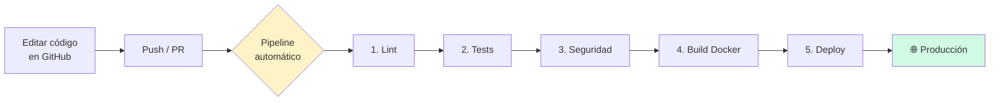

# 🚀 DevOps en vivo — Clase de Arquitectura de Software

Bienvenidos a la **Fábrica de Software**. Este repositorio es el laboratorio que vamos a usar en la clase de hoy. **Todo se ejecuta desde el navegador**, sin instalar nada.

---

## 🎯 ¿Qué van a aprender hoy?

Al final de esta clase van a entender — **viéndolo funcionar en vivo** — los conceptos que sustentaron sus compañeros:

1. **CI/CD** — un robot revisa, prueba y despliega su código
2. **IaC** — la infraestructura escrita como código
3. **Despliegues seguros** — Blue/Green y Canary
4. **Observabilidad** — saber qué pasa dentro de su sistema
5. **DevSecOps** — seguridad desde el primer commit
6. **Contenedores** — empaquetar la app para que corra igual en cualquier parte
7. **GitOps** — Git como única fuente de verdad
8. **SRE** — confiabilidad medida con números, no opiniones

---

## 🗺️ Mapa del repositorio

```
.
├── src/                      ← El código de la aplicación (mínimo, simple)
├── tests/                    ← Las pruebas automáticas
├── Dockerfile                ← La "receta" para empacar la app
├── .github/workflows/        ← El PIPELINE que veremos correr en vivo
│   └── ci-cd.yml
├── terraform/                ← Ejemplo de Infraestructura como Código
│   └── main.tf
├── k8s/                      ← Ejemplo de manifiesto Kubernetes
│   └── deployment.yaml
└── README.md                 ← Este archivo
```

---

## 🔄 El flujo que vamos a ver hoy



**Si una etapa falla, el pipeline se detiene. El código nunca llega a producción rota.** Esa es la magia de DevOps.

---

## 🧪 Demo en clase

Durante la clase, su profesor va a:

1. **Hacer un cambio** en el código en vivo
2. **Hacer push** a una rama
3. **Mostrar el pipeline** ejecutándose paso a paso
4. **Romper algo a propósito** para que vean cómo el pipeline lo detiene
5. **Arreglarlo y mergear** para ver el deploy automático

**Pestañas de GitHub que vamos a usar:**
- `Code` — el código fuente
- `Pull requests` — los cambios propuestos
- `Actions` — el pipeline corriendo (¡aquí está la magia!)

---

## 📚 Conceptos clave para llevarse de la clase

### Las 4 métricas DORA (esto les preguntan en entrevistas)

| Métrica | Qué mide | Élite |
|---|---|---|
| **Deployment Frequency** | Qué tan seguido despliegan | Varias veces al día |
| **Lead Time for Changes** | Del commit a producción | < 1 hora |
| **Change Failure Rate** | % de despliegues que rompen | 0-15% |
| **MTTR** | Tiempo de recuperación | < 1 hora |

### Las 3 ideas que NO deben olvidar

1. **DevOps no es herramientas, es eliminar fricción entre intención y producción.**
2. **Si no es código, no es reproducible. Si no es reproducible, no es DevOps.**
3. **Lo que no se mide, no se mejora.**

---

## 🔗 Recursos para seguir aprendiendo (gratis)

- [GitHub Learning Lab](https://lab.github.com/)
- [Roadmap DevOps](https://roadmap.sh/devops)
- [Google SRE Book (gratis online)](https://sre.google/books/)
- [The Twelve-Factor App](https://12factor.net/)
- [DORA - State of DevOps Report](https://dora.dev/)

---

*Clase de Arquitectura de Software · Universidad Jorge Tadeo Lozano · 2026*
